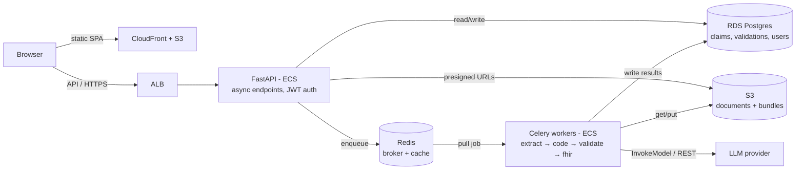

# ClaimBridge — Scaling Architecture & Rollout Plan

Status: **planning** (target ~50–100 hospital claims-desk users). This document
captures the target architecture for making ClaimBridge horizontally scalable
and the phased path to get there. It is a plan, not yet implemented.

See also `CLAUDE.md` for product context and the engine design.

---

## The one insight that shapes everything

**The ~20s-per-claim cost is mostly spent waiting on the LLM HTTP call, not
burning CPU.** The pipeline is therefore **I/O-bound**, not CPU-bound.

| Stage | Bound by | Right tool |
|---|---|---|
| PDF→PNG render for scans (`pdf2image`/poppler) | CPU | process pool (Celery prefork gives this for free) |
| extract → code → validate (LLM REST calls) | I/O (LLM latency + rate limits) | async concurrency + a job queue |
| `fhir_builder` | trivial CPU | inline |

**Conclusion:** don't hand-roll `multiprocessing.Pool` in the request path. Use
**Celery** — its default prefork pool *is* multiprocessing (CPU parallelism for
rendering) *and* it gives distribution, retries, and horizontal scaling. The
real ceiling at this scale is **LLM provider rate limits and cost**, not servers.

Right-sizing note: 50–100 users ≈ 5–20 concurrent submissions at peak, ~20s
each. Celery prefork concurrency of 4 handles ~12 claims/min — far more than
needed. **This does not need Kubernetes, a fleet, or aggressive autoscaling.**

---

## What blocks scale today

Three things in the current `extraction/api.py`, all fixable:

1. **Synchronous 20s request** blocks a web worker → move to a queue.
2. **State on the local filesystem** (`app_data/*.json` + uploaded files) →
   can't share across app instances → move to Postgres + object storage.
3. **In-memory auth** (`DEMO_USERS` + `_TOKENS` dicts) → lost on restart, not
   shared across instances → move to JWT + Postgres.

The engine modules (`extractor`, `coder`, `validator`, `fhir_builder`, `llm`)
are already cleanly separated and **do not change** — that boundary is what
makes this migration safe.

---

## Target architecture

**Component choices (opinionated):**

- **Redis (ElastiCache)** — one node does triple duty: Celery broker, Celery
  result backend, and cache (code lists, sessions, per-tenant rate limiter).
- **Postgres (RDS)** — replaces the JSON files. Gives a *queryable* claims table
  (Dashboard/Claims filters + pagination become real queries), `hospital_id`
  multi-tenancy, and an audit trail. Biggest single upgrade.
- **S3** — replaces `app_data/uploads` and `bundles`; preview/download via
  presigned URLs. Server-side encryption on.
- **ECS Fargate, two services** — API and Worker, scaled independently.
- **JWT + hashed passwords** in Postgres — replaces demo auth.

**Async flow (the behavioral change):**

1. `POST /api/claims` → save files to storage, insert claim row `status=QUEUED`,
   enqueue Celery task, **return `202` immediately** with `claim_id`.
2. Celery worker → pulls files, runs `extract → code → validate → fhir`, writes
   results, updates `status` (QUEUED → RUNNING → REVIEW/PASS/FAIL → APPROVED).
3. Frontend → polls `GET /api/claims/{id}` for status. The React
   `ProcessingStepper` already maps onto this — swap its single blocking call
   for status polling and it reflects real stage transitions.

---

## Phased rollout

Ordered so each phase is independently shippable and testable.

### Phase A — decouple state (local, dockerized; NO AWS, no spend)

Gets ~80% of the scalability win and runs entirely on a laptop via
`docker-compose`. Dependency-ordered steps:

- **A1 — Infra scaffold.** `docker-compose.yml` with `postgres`, `redis`,
  `minio` (S3-compatible so the same storage code works local→AWS), and the
  app. Config via env vars.
- **A2 — Database layer.** `db.py` + `models.py` (SQLAlchemy): `claims`,
  `validations`, `documents`, `users`, `hospitals`. Port the `_paths`/`_load`/
  `_summary` JSON reads in `api.py` to DB queries.
- **A3 — Object storage.** `storage.py` — put/get for uploads + bundles against
  MinIO/S3, preview & download via presigned URLs. Replaces filesystem paths.
- **A4 — Task queue.** `tasks.py` — Celery app (Redis broker + backend) with a
  `process_claim` task wrapping the existing pipeline.
- **A5 — Thin API.** `POST /api/claims` → save files → insert `status=QUEUED` →
  enqueue → return `202`. Add status transitions readable via `GET`.
- **A6 — Frontend polling.** Swap `UploadFlow`/`ProcessingStepper`'s blocking
  `createClaim` await for status polling.
- **A7 (optional) — Real JWT auth.** bcrypt + `users` table, replacing the demo
  dicts. May slip to Phase B.

**Gotchas specific to this project:**
- **Run the Celery worker inside the docker container, not on the Windows
  host** — Celery's prefork pool is flaky on Windows; the Linux container avoids
  it. The worker image needs `poppler` baked in for `pdf2image`.
- **Leave `pipeline.py` / `evaluate.py` alone.** They call the engine directly
  (not the API), stay synchronous and file-based, and remain the accuracy gate.
  Only the *API path* goes async — the corpus benchmark still runs unchanged.

### Phase B — deploy to AWS

Containerize → ECR → ECS Fargate (API + worker services) + RDS Postgres +
ElastiCache Redis + S3 (MinIO code ports over unchanged) + ALB + CloudFront for
the React build. Real JWT auth if not already done. Region: **`ap-south-1`
(Mumbai)** for India data residency.

### Phase C — harden

Per-tenant LLM rate limiting (Redis token bucket — the real ceiling), retries
with backoff, CloudWatch logs/alarms, autoscale workers on queue depth.

---

## Compliance (must-haves, bake in from Phase B)

Indian health data (ABDM/NHCX, DPDP Act 2023):
- Deploy in **`ap-south-1` (Mumbai)** — data residency in India.
- Encryption at rest (S3 SSE, RDS) + in transit (TLS everywhere).
- Audit logging; least-privilege IAM.

Rough infra cost at this scale: **~$150–300/mo** (small Fargate tasks +
`db.t4g.micro/small` RDS + `cache.t4g.micro` Redis + S3), plus LLM API usage,
which will likely dwarf the infra bill.

---

## Deferred decision: LLM data privacy (AWS Bedrock)

Deferred for now, but recorded because it's the most important compliance lever.
Calling Gemini/OpenAI/Anthropic public APIs directly sends PHI (patient names,
UHIDs, diagnoses) to a third party outside the trust boundary.

**AWS Bedrock** keeps inference inside AWS (your IAM, your DPA, no prompt
retention, no training on your data). With a **VPC PrivateLink endpoint** for
`bedrock-runtime` the LLM call never touches the public internet, and in
`ap-south-1` it stays in India. It fits the provider-agnostic `llm.py` as a new
`bedrock` provider (IAM role instead of an API key; boto3 handles SigV4 — a
minor bend of the "no vendor SDKs" rule, justified since boto3 is AWS infra).

Caveats when we pick this up:
- **Re-benchmark is mandatory** (per `CLAUDE.md`): the 100% accuracy figure was
  measured on Gemini; switching models means rerunning `pipeline.py` +
  `evaluate.py`. Provider-agnostic design makes "we tested N models" a pitch asset.
- **Verify model + region availability** in `ap-south-1`; pin the region and
  avoid cross-region inference profiles (they can route PHI out of India).
- No free tier — pay-per-token like the direct APIs.

Alternatives considered: self-hosted open vision model (SageMaker/EC2 GPU — max
control, heavy ops, weaker at OCR-heavy extraction; overkill at this scale);
"Claude Platform on AWS" (Anthropic-operated, same-day parity). Bedrock is the
pragmatic middle for a residency + AWS-native-governance goal.
